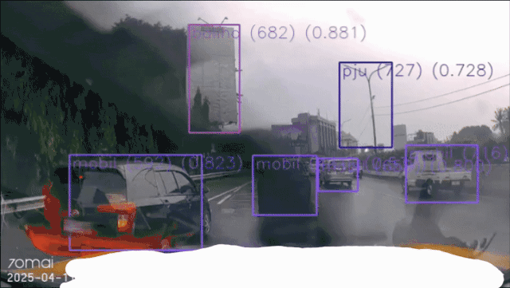
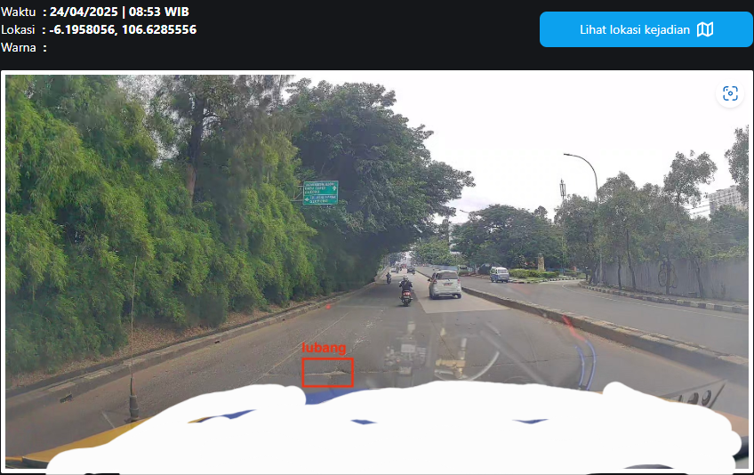
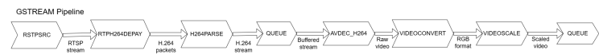
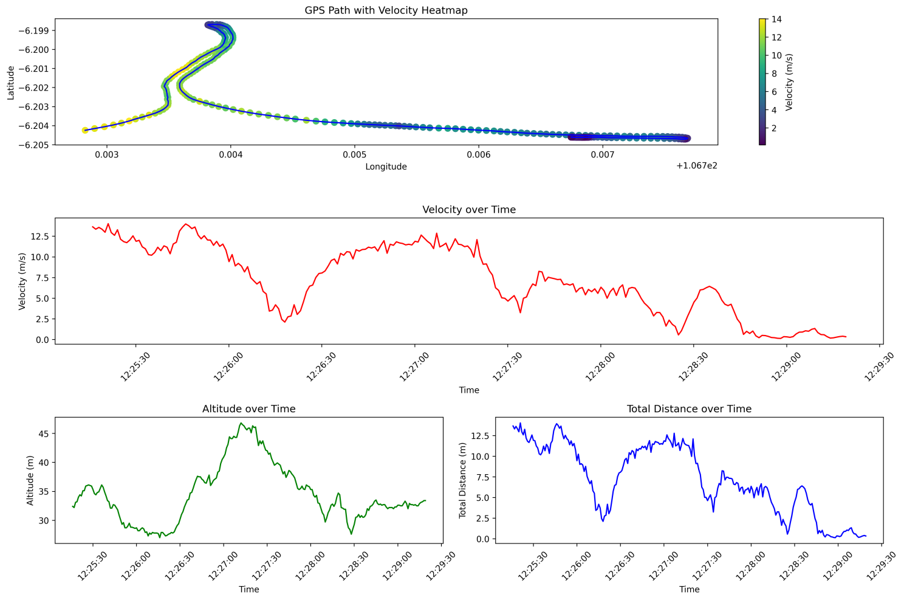
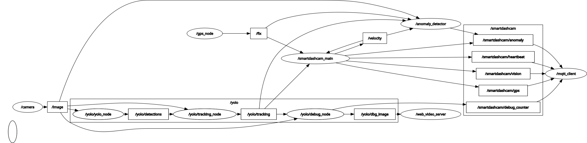

# ROS2 Smartdashcam

Edge-based smart dashcam framework for infrastructure and road monitoring. Built on ROS 2, it turns a camera feed into real-time detection, GPS tracking, and cloud reporting for mobile monitoring scenarios such as patrol vehicles, toll roads, and fleet operations.

This repository demonstrates how affordable edge devices (for example, Raspberry Pi 4) can handle real-world monitoring workloads.

## Why ROS 2?

A monolithic Python app was tried first: when detection and streaming lived in one process, **detection often failed**. The RTSP feed is network-based and **frames keep dropping**; in a non-modular setup, those drops and latency became a single point of failure. With **ROS 2, everything is modular and each node can run on its own**. The camera node can publish frames independently; the detector subscribes when it can; if the stream hiccups, the rest of the system keeps going. With this design, you can get a stable pipeline even on a Raspberry Pi 4 with an RTSP source.

## What this repo can do

- **Live camera pipeline**: Ingest RTSP (or other sources) via GStreamer, with support for multi-format web streaming (MJPEG/VP8).
- **Real-time object detection**: YOLOv8 using ONNX runtime for cars, trucks, buses, and other objects; optional tracking and overlay for a live view.
- **Anomaly reporting**: Flag detections as anomalies (e.g. road damage, hazards, unauthorized access) and associate them with location.
- **GPS and telemetry**: NMEA data gives accurate car position, velocity, and driving line (roadmap) for location tagging, statistics, and anomaly reporting.
- **Reporting**: This repo only handles the report side: MQTT-based upload of counts, anomaly reports, GPS, and device status (camera, GPS, RSSI), typically over 4G or other connectivity for instant transmission. The dashboard that consumes this data is outside this repo.
- **Web monitoring**: Stream the processed camera view and debug overlays through a web video server for remote monitoring.

Built as modular ROS 2 nodes (GStreamer camera, YOLO detector, anomaly filter, GPS, MQTT client, main coordinator) so you can run full pipelines or only the parts you need. Node priority is managed by dataflow so all nodes work together properly; the modular layout makes managing and troubleshooting straightforward.

## Screenshots & Demo

| Live stream | Anomaly report |
|-------------|----------------|
|  |  |

- **Left:** Live stream from the patrol camera with real-time object detection overlay (real-time view of the monitored area).
- **Right:** Anomaly detection report: objects flagged as anomalies with their detected locations (e.g. road damage, hazards).

The [GPS & localization](#gps--localization) and [GStreamer pipeline](#gstreamer-pipeline-optimum-config) sections above show GPS data (position, altitude, velocity along the route) and the streaming pipeline diagram.

## Pipeline, GPS & architecture

### GStreamer pipeline (optimum config)
The video pipeline is defined in [`smartdashcam/config/gscam_pipeline.yaml`](smartdashcam/config/gscam_pipeline.yaml). This is the **optimum configuration** for efficient RTSP streaming on edge devices. On a **Raspberry Pi 4** with **YOLOv8 nano** running, you can expect roughly **1.5–2.1 FPS**; FPS may occasionally drop by about 0.7. The pipeline is tuned for stability and low latency while keeping detection usable on resource-limited hardware.

Pipeline stages (see figure below):

| Stage | Role |
|-------|------|
| **rtspsrc** | Receives RTSP stream; zero latency, drop-on-latency, retry and UDP reconnection |
| **rtph264depay** | Extracts H.264 from RTP packets |
| **h264parse** | Parses H.264 stream |
| **queue** | Buffers stream (e.g. 8192 buffers, leaky downstream) |
| **avdec_h264** | H.264 decode (multi-threaded, e.g. 8 threads) |
| **videoconvert** | Format conversion to RGB (multi-threaded, QoS) |
| **videoscale** | Scale to 640×360 |
| **queue** | Output stream management |



### GPS & localization
GPS data is used to **accurately locate** the vehicle: position (latitude, longitude, altitude), **velocity**, and **driving line (roadmap)**. That information is used for location-tagged anomaly reports and statistics, and is sent via MQTT for use by an external dashboard.



### Modular node design
The system uses a **modular ROS 2 architecture** so components can be plugged in or out for easier maintenance and updates. Node **priority follows the dataflow** (see rosgraph below):

- **GStreamer (gscam)** publishes the camera feed on `/image_raw`. The **YOLO (detection) node** subscribes for object detection, tracking, and debug overlay; results can be viewed via the **web video server**.
- The **GPS node** reads NMEA and publishes latitude, longitude, altitude, and velocity.
- The **anomaly node** filters detections considered anomalies and sends them (with location) to the backend/database.
- **smartdashcam_main** acts as the central coordinator and runs the **MQTT client**, which sends GPS location, object-count statistics, anomaly reports, and **heartbeat** data (camera status, GPS status, RSSI) for the external dashboard.

This keeps all nodes working together without contention and makes it easy to run subsets of the stack or **troubleshoot** by enabling or disabling individual nodes.



## Prerequisites
- Ubuntu 24.04
- ROS 2 Jazzy
- Python 3.8+
- GStreamer and related plugins

## Installation

### 1. ROS 2 Jazzy Installation
Follow these commands to install ROS 2 Jazzy:
```bash
# Add ROS 2 apt repository
sudo apt update && sudo apt upgrade -y
sudo apt install software-properties-common -y
sudo add-apt-repository universe

# Setup ROS 2 keys and repository
sudo apt update && sudo apt install curl -y
sudo curl -sSL https://raw.githubusercontent.com/ros/rosdistro/master/ros.key -o /usr/share/keyrings/ros-archive-keyring.gpg
echo "deb [arch=$(dpkg --print-architecture) signed-by=/usr/share/keyrings/ros-archive-keyring.gpg] http://packages.ros.org/ros2/ubuntu $(. /etc/os-release && echo $UBUNTU_CODENAME) main" | sudo tee /etc/apt/sources.list.d/ros2.list > /dev/null

# Install ROS 2 packages
sudo apt update
sudo apt install -y ros-jazzy-ros-base
sudo apt install -y ros-dev-tools
```

### 2. System Dependencies
Install required system packages:
```bash
# Install GStreamer and multimedia packages
sudo apt install -y \
    gstreamer1.0-tools \
    gstreamer1.0-plugins-base \
    gstreamer1.0-plugins-good \
    gstreamer1.0-plugins-bad \
    gstreamer1.0-plugins-ugly \
    gstreamer1.0-libav

# Install development packages
sudo apt install -y \
    libjpeg-dev \
    zlib1g-dev \
    nlohmann-json3-dev \
    python3-opencv \
    python3-pip \
    python3-venv

# Install ROS 2 specific packages
sudo apt install -y \
    ros-jazzy-cv-bridge \
    ros-jazzy-vision-opencv \
    ros-jazzy-image-transport \
    ros-jazzy-image-transport-plugins
```

### 3. Python Dependencies
Install Python requirements:
```bash
# Update pip
python3 -m pip install --upgrade pip --break-system-packages

# Install Python packages
python3 -m pip install -r requirements.txt --break-system-packages

# Install additional ROS 2 Python packages
python3 -m pip install transforms3d --break-system-packages
```

### 4. ROS Dependencies
Initialize and install ROS dependencies:
```bash
# Source ROS 2
source /opt/ros/jazzy/setup.bash

# Initialize rosdep
sudo rosdep init
rosdep update

# Install ROS package dependencies
rosdep install --from-path src --ignore-src -y
```

### 5. Create and Build Workspace
```bash
# Create workspace
mkdir -p ~/jazzy_ws/src
cd ~/jazzy_ws/src

# Clone the repository
git clone https://github.com/hifzhil/ros2_smartdashcam.git
cd ros2_smartdashcam
git submodule init && git submodule update

# Build the workspace (yolo_msgs and smartdashcam_msgs should be build first before the others)
cd ~/jazzy_ws
colcon build --packages-select yolo_msgs smartdashcam_msgs
source install/setup.bash
colcon build
source install/setup.bash

# Add source to bashrc for automatic setup
echo "source ~/jazzy_ws/install/setup.bash" >> ~/.bashrc
```

### 6. Build and service scripts
```bash
# Assign device ID and build/update
~/jazzy_ws/src/ros2_smartdashcam/script/build_ros2.sh

# Remove old service and register new service
~/jazzy_ws/src/ros2_smartdashcam/script/assign_service.sh
```

## Usage

### Starting Core Services

1. **Main Service**
   ```bash
   ros2 launch smartdashcam main.launch.py
   ```

2. **Camera Stream**
   ```bash
   ros2 launch smartdashcam gscam.launch.py
   ```

3. **Object Detection**
   ```bash
   ros2 launch smartdashcam yolov8.launch.py
   ```

4. **Anomaly Detector**
   ```bash
   ros2 launch smartdashcam anomaly_detector.launch.py
   ```

5. **GPS Service**
   ```bash
   ros2 launch smartdashcam gps_bringup.launch.py
   ```

6. **MQTT Service**
   ```bash
   ros2 launch smartdashcam mqtt_service.launch.py
   ```

7. **Web Video Server**
   ```bash
   ros2 launch smartdashcam web_video_server.launch.py
   ```

### Additional Services

- **RDD Detector** (under development for improving road-damage detection; not part of core service yet)
  ```bash
  ros2 launch smartdashcam rdd_detector.launch.py
  ```

- **Image Publisher** (for testing with video files)
  ```bash
  ros2 run image_publisher image_publisher_node video_sample.MP4
  ```

## Using your own model

1. **Object detection (YOLO/ONNX)**  
   - Place your `.onnx` or `.pt` file (e.g. in `smartdashcam/config/model/`).  
   - Set the path in **`smartdashcam/config/yolov8_config.yaml`**: `model: "/path/to/your/model.onnx"` (or relative to the package share dir).  
   - When using the launch file, you can override with: `ros2 launch smartdashcam yolov8.launch.py model:=/path/to/your/model.onnx`.  
   - Ensure input size and topic in `yolov8_config.yaml` match your pipeline (e.g. `imgsz_width`, `imgsz_height`, `input_image_topic`).

2. **Anomaly filtering**  
   - The anomaly node filters detections by **class name** and confidence. Its default class list (e.g. `lubang`, `guardrail_hilang`, `kendaraan_berhenti`) must match the **class names produced by your model**.  
   - Either edit the `anomaly_config` dict in `smartdashcam/scripts/anomaly_detector_node.py` to your classes and confidence thresholds, or point the node to a config file that defines them (if you add that option).

3. **RDD detector (road damage)**  
   - The **`full_model.h5`** model is **free and open source** and is installed with the package at `share/smartdashcam/config/model/full_model.h5`. The `rdd_detector` node uses this path by default. To use a different model, set the **`model_path`** parameter.

4. **CMake / install**  
   - The project installs **only** the RDD model (`full_model.h5`) and a README in `config/model/`. No YOLO/ONNX model is installed—add your own and set the path in `yolov8_config.yaml` or at launch.

## Configuration
Configuration files are in the package `config` directories (e.g. `smartdashcam/config/`):
- `gscam_pipeline.yaml`: GStreamer RTSP/camera pipeline (optimum edge config; see [Pipeline, GPS & architecture](#pipeline-gps--architecture))
- `yolov8_config.yaml`: Object detection settings — **set `model` to your own ONNX/PT path**
- `smartdashcam_config.yaml` / `smartdashcam_config_default.yaml`: MQTT, anomaly, and device config
- `mqtt_config.yaml`: MQTT broker settings (if used)
- `gps_config.yaml`: GPS settings (if used)

## Troubleshooting
Common issues and their solutions:
1. If the camera stream doesn't start, check your camera permissions:
   ```bash
   sudo usermod -a -G video $USER
   ```

## Contributing
1. Fork the repository
2. Create your feature branch (`git checkout -b feature/amazing-feature`)
3. Commit your changes (`git commit -m 'Add amazing feature'`)
4. Push to the branch (`git push origin feature/amazing-feature`)
5. Open a Pull Request

## License
This project is licensed under the 3-Clause BSD License - see the [LICENSE](LICENSE) file for details.

## Acknowledgments
- ROS 2 Community
- OpenCV Team
- https://github.com/mgonzs13/yolo_ros
